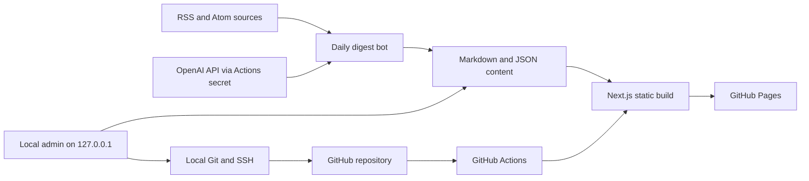

# Pixel-Map V2 Design

**Status:** Approved in conversation on 2026-07-10

## Goal

Evolve Pixel-Map into a durable GitHub Pages blog system with three bounded capabilities:

1. Publish one bilingual technical-news digest every day around 08:30 Asia/Shanghai.
2. Provide a mature local-only administration application for site configuration and content management.
3. Replace the flat home canvas and generic route fades with a restrained 2.5D pixel-map experience.

The public site remains a statically exported Next.js application deployed by GitHub Pages. Markdown files and JSON configuration remain the source of truth.

## Constraints

- Keep GitHub Pages as the only production host.
- Keep content in Git-tracked Markdown and JSON files.
- Do not expose any administration route or administration bundle in the production export.
- Do not store GitHub tokens or OpenAI keys in browser storage or tracked files.
- Preserve bilingual navigation and news content.
- Preserve migrated legacy posts, Markdown code blocks, and legacy images.
- Respect keyboard navigation, touch input, and `prefers-reduced-motion`.
- Do not replace the current application with an online CMS or database.
- Do not use Three.js for the map; the required depth is achievable with a lighter isometric canvas renderer.

## System Architecture



The three implementation modules communicate only through versioned repository files:

- The news bot writes daily digest Markdown and news state JSON.
- The local admin reads and writes allowed content and configuration paths.
- The public application reads those files at build time and never depends on the local admin runtime.

## Module 1: Daily News Digest

### Product Behavior

- Publish at most one digest for each Asia/Shanghai calendar date.
- Target 08:30 Asia/Shanghai with a second catch-up trigger at 09:10.
- Select 5-8 relevant items published within the previous 72 hours when enough items are available.
- Publish fewer items when the feeds provide fewer valid results; never pad the digest with stale or invented content.
- Each item contains a Chinese and English title, concise bilingual summary, concise bilingual editorial note, source name, publication date when available, and the original URL.
- The news index lists daily digests. Each digest has its own static detail route.

### Content Model

Each run writes one file:

```text
src/content/news/YYYY-MM-DD-daily-digest.md
```

The frontmatter contains digest-level list metadata:

```yaml
---
type: "daily-digest"
title: "Daily Signals - 2026-07-10"
titleZh: "每日技术资讯 - 2026-07-10"
titleEn: "Daily Signals - 2026-07-10"
date: "2026-07-10"
summaryZh: "今日技术资讯摘要。"
summaryEn: "Today's technology digest."
tags: ["daily-digest", "technology"]
published: true
itemCount: 6
sources: ["GitHub Blog", "web.dev"]
---
```

The body is regular Markdown with one section per selected item. The renderer therefore preserves code, links, headings, and images without introducing another content format. Every item ends with an explicit source link.

The state file remains at `src/content/config/news-seen.json` and gains these fields:

```json
{
  "lastPublishedDate": "2026-07-10",
  "updatedAt": "2026-07-10T00:31:00.000Z",
  "urls": []
}
```

`lastPublishedDate` and the presence of the digest file form the idempotency check. The catch-up run exits without changing files when the day's digest already exists.

### Selection Pipeline

1. Resolve the current calendar date in `Asia/Shanghai` explicitly.
2. Fetch configured feeds concurrently.
3. Apply a 10-second timeout per request and at most two attempts per source.
4. Normalize RSS and Atom records into one internal `FeedItem` shape.
5. Reject invalid URLs, empty titles, future-dated items beyond clock tolerance, and items older than 72 hours.
6. Deduplicate by canonical URL and normalized title.
7. Rank by configured source weight, topic keyword relevance, and freshness.
8. Send only the selected records to the OpenAI Responses API for bilingual summarization.
9. Validate the returned array length and required string fields before rendering Markdown.
10. Write the digest and update state atomically after every validation succeeds.

Scheduled production runs require `OPENAI_API_KEY` from GitHub Actions Secrets. They fail before writing content when the key is absent or summarization is invalid. Local development may opt into source-summary fallback explicitly, but fallback output is never silently published by the scheduled workflow.

### Workflow Design

- Primary cron: `30 0 * * *` (08:30 Asia/Shanghai).
- Catch-up cron: `10 1 * * *` (09:10 Asia/Shanghai).
- `workflow_dispatch` supports a controlled `force` input for manual recovery.
- News generation uses a `daily-news` concurrency group.
- Pages deployment alone uses the shared `pages` concurrency group.
- A changed digest is tested, built, committed, pushed, uploaded, and deployed in the same workflow run because a `GITHUB_TOKEN` push does not trigger the normal Pages workflow.
- A no-op run does not modify timestamps, create commits, build the site, or deploy.

### Failure Behavior

- One failed source: continue with the remaining sources and report the source failure in the Actions log.
- All sources failed: fail the job and write nothing.
- No fresh valid items: finish without a commit and leave the previous site intact.
- Missing or invalid OpenAI output: fail and write nothing.
- Push race: rebase once on the current `main`, rerun the idempotency check, then push; a second failure stops the workflow.
- Pages deployment failure: retain the committed digest so a manual Pages deployment can recover without regenerating content.

### Migration

Existing generated single-item news files are consolidated by date into daily digest files. Hand-written historical signals remain visible by migrating each existing date into a one-item legacy digest. Existing URLs are retained in the seen-state list.

## Module 2: Local Administration Application

### Isolation Model

The current `src/app/admin` route and GitHub-token client are removed. The replacement lives outside the public Next.js route tree:

```text
admin/
  index.html
  src/
  server/
  vite.config.ts
```

`npm run admin` starts one Vite-based local application bound to `127.0.0.1`. The public `npm run build` does not import, bundle, or export it. CI explicitly verifies that `out/admin/index.html` does not exist.

The administration server:

- accepts requests only through the loopback interface;
- rejects non-local Host and Origin values;
- uses a per-process session secret in an HttpOnly, SameSite cookie;
- accepts JSON mutations only from the same origin;
- never reads or stores a GitHub token;
- invokes Git with fixed argument arrays and never interpolates user text into a shell command.

### Application Structure

The UI uses a persistent work-focused shell with separate routes:

```text
/                 Overview
/tabs             Navigation and map nodes
/content          Article collections
/content/:type/:slug  Article editor
/media            Image library
/publish          Validation, commit, and push
```

Each route owns its own page component, state, loading state, empty state, and errors. Shared elements are limited to the shell, status banner, form controls, Markdown editor, preview, confirmation dialog, and API client.

### Overview

The overview reports:

- counts for blog posts, news digests, projects, and custom pages;
- the most recent digest date and whether today's digest exists;
- working-tree status without exposing ignored or unrelated file contents;
- the configured Git remote and current branch;
- the last local validation result.

### Tab Management

The duplicated `nav` and `mapNodes` arrays are normalized to one ordered `tabs` collection. Each tab includes:

```text
id, kind, label, zh, href, visible, order, map
```

`map` contains the glyph, landmark type, position, color token, bilingual title, and bilingual description.

Supported tab kinds:

- `built-in`: points to an existing application route;
- `page`: points to a Markdown-backed custom page;
- `external`: points to a validated HTTPS URL.

The manager supports add, edit, reorder, show/hide, and remove. Built-in routes can be hidden but not deleted. Removing a tab never deletes associated content automatically.

Creating a `page` tab also creates `src/content/pages/<slug>.md`. A generic static route reads the page collection and generates parameters at build time. Reserved route names and collisions are rejected before writing.

### Content Management

Collections are managed separately:

- Blog posts
- Daily news digests
- Projects
- Custom pages

The list view supports search, tag filtering, publication state, creation, duplication, and deletion with confirmation. The editor separates structured metadata from the Markdown body and provides a live preview through the same Markdown rendering rules used by the public site.

Writes use optimistic version checks based on the file modification time and content hash. If a file changed outside the admin after it was loaded, saving is rejected and the user is offered reload or explicit overwrite.

### Media Management

- Upload images to `public/uploads` with sanitized, collision-resistant file names.
- List image dimensions, size, path, and references when discoverable.
- Copy the correct base-path-safe Markdown reference.
- Delete only files inside the media allowlist and require confirmation.
- Legacy post assets remain read-only unless explicitly migrated.

### Publish Management

The publish route shows a structured diff summary and allows the user to select files created through the admin. It then runs this sequence:

1. Validate JSON and frontmatter schemas.
2. Run news, Markdown, admin-server, and content tests.
3. Run TypeScript checking.
4. Build the static site.
5. Verify required exported files and verify the absence of the admin export.
6. Stage only the selected paths.
7. Commit with the user-provided message.
8. Push the current branch through the repository's existing SSH remote.

An existing unrelated dirty file is never staged automatically. Build or push failure leaves local edits and commits intact and reports the exact recovery action.

### Local API Boundaries

The server exposes focused handlers rather than a generic filesystem endpoint:

```text
GET  /api/health
GET  /api/overview
GET  /api/tabs
PUT  /api/tabs
GET  /api/content
GET  /api/content/:collection/:slug
POST /api/content/:collection
PUT  /api/content/:collection/:slug
DELETE /api/content/:collection/:slug
GET  /api/media
POST /api/media
DELETE /api/media/:name
GET  /api/git/status
POST /api/git/validate
POST /api/git/publish
```

Every content and media operation resolves paths through a collection allowlist and confirms the final path remains inside the expected repository directory.

## Module 3: 2.5D Pixel Map and Motion

### Visual Direction

The site remains dark, pixel-oriented, and content-first. The map becomes the one expressive surface; article and administration interfaces remain quieter and denser.

The home scene uses a multi-color isometric terrain inspired by voxel sandbox maps without copying Minecraft assets. It contains:

- stepped grass and stone elevations;
- shallow water tiles;
- illuminated paths connecting landmarks;
- one distinct pixel landmark for each visible tab;
- restrained windows and signal lights that animate infrequently;
- soft directional shadows built from solid pixel shapes rather than gradients or decorative glow fields.

### Renderer

The Canvas 2D renderer uses an isometric projection:

```text
screenX = originX + (worldX - worldY) * tileWidth / 2
screenY = originY + (worldX + worldY) * tileHeight / 2 - elevation * levelHeight
```

The world layout is deterministic from tab configuration. Static terrain is cached in an offscreen canvas. Only water, landmark hover state, occasional light state, and pointer parallax redraw. Rendering is capped at 30 frames per second and device pixel ratio is capped at 2.

Accessible HTML links remain the interaction surface. They are positioned from the same projected landmark coordinates, so keyboard focus and touch do not depend on canvas hit testing. Hover or focus raises a landmark, brightens its connected path, and reveals the bilingual label. Pointer movement adds at most a few pixels of parallax and never changes layout.

Mobile uses a smaller deterministic map with fewer terrain tiles and larger landmark targets. It remains isometric instead of falling back to an unrelated list, while the existing content preview moves below it.

### Route Transitions

A single transition coordinator handles internal navigation:

1. Ignore modified clicks, external links, downloads, and same-page anchors.
2. For a normal internal navigation, mark the target tab theme and start a 220 ms exit.
3. Fold the current page into shallow pixel layers using perspective and opacity.
4. Navigate with the Next.js router.
5. Reveal the destination from a matching 280-320 ms depth transform.

Map-node navigation additionally focuses the selected landmark before the page fold. Header navigation uses the same transition vocabulary without pretending to originate from a landmark.

Scroll reveals use one consistent distance and easing curve. Article text itself is never hidden behind an observer; only bounded list items and panels are reveal targets. With reduced motion enabled, navigation is immediate and all depth, parallax, beacon, and reveal animations are disabled.

### Interaction Limits

- No continuous full-screen flicker.
- No camera rotation larger than a subtle visual offset.
- No transition longer than 320 ms before navigation becomes usable.
- No animation may resize controls or move text under the pointer.
- Canvas is decorative to assistive technology; every destination is represented by a semantic link.

## Data and Schema Ownership

- `src/content/config/tabs.json`: ordered site navigation and map landmark configuration.
- `src/content/config/news-sources.json`: feed sources, weights, freshness, and selection limits.
- `src/content/config/news-seen.json`: daily publication state and canonical seen URLs.
- `src/content/blog`: blog Markdown.
- `src/content/news`: daily digest Markdown only after migration.
- `src/content/projects`: project Markdown.
- `src/content/pages`: custom page Markdown.
- `public/uploads`: admin-managed media.

Configuration parsing and validation live in shared server-safe modules used by the build, scripts, and local admin server. Client components consume validated values and do not parse arbitrary files.

## Testing Strategy

### News

- Feed parsing for RSS and Atom.
- Asia/Shanghai date resolution around UTC day boundaries.
- Freshness filtering, canonical URL normalization, title deduplication, and ranking.
- One digest per day and catch-up no-op behavior.
- Invalid OpenAI output produces no file or state mutation.
- Partial-source and all-source failure behavior.
- Markdown output always includes original links.

### Admin Server

- Loopback host and Origin enforcement.
- Collection allowlists and traversal rejection.
- Tab schema validation and reserved-route protection.
- Content create, read, update, conflict, and delete behavior in temporary fixtures.
- Media filename sanitization and path containment.
- Git commands receive fixed argument arrays and stage only selected paths.

### Public Application

- Content schema and Markdown rendering tests.
- Static generation of daily digest and custom-page routes.
- Build verification for required pages and absence of `out/admin`.
- TypeScript checking and production build.

### Browser Acceptance

- Desktop and mobile home-map framing.
- Canvas pixel sampling confirms the map is nonblank and multi-color.
- Landmark hover, keyboard focus, and touch-sized controls.
- Route exit and entry states for map and header navigation.
- Reduced-motion behavior.
- Admin section navigation, article editing, preview, and validation flow on localhost.

## Delivery Order

1. Introduce shared schemas and daily-digest content model.
2. Implement and test the idempotent news pipeline and resilient workflow.
3. Migrate existing news content and add digest detail routes.
4. Remove the public admin route and implement the isolated local admin server APIs.
5. Implement the modular admin client and publishing workflow.
6. Normalize tab configuration and add Markdown-backed custom pages.
7. Implement the isometric map renderer and landmark interactions.
8. Implement coordinated 2.5D route transitions and reduced-motion behavior.
9. Run all automated and browser acceptance checks.
10. Present desktop and mobile screenshots for review, then commit and push the completed implementation.

## Acceptance Criteria

- A successful scheduled run produces exactly one bilingual digest for the Asia/Shanghai date and includes original links for every item.
- A missed primary schedule can be recovered by the catch-up schedule without duplicate publication.
- `npm run admin` opens a usable local administration application bound only to loopback.
- The GitHub Pages artifact contains no administration page or administration JavaScript.
- Tabs, articles, projects, custom pages, and media can be managed without editing raw repository paths.
- Publishing from the admin uses the current local Git/SSH identity and never requests a browser token.
- The home page displays a responsive multi-color isometric pixel map with accessible landmarks.
- Internal tab navigation uses a coherent 2.5D exit and entry transition, with an immediate reduced-motion fallback.
- Legacy posts, code blocks, and images continue to render.
- All automated tests, type checking, production build, and browser acceptance checks pass before push.
